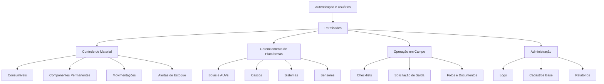
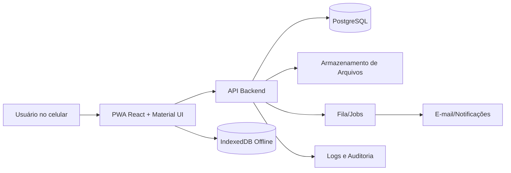

# Plano Geral de Implementação — Sistema REMOBS

## 1. Objetivo

Implementar um sistema web responsivo para o projeto REMOBS, focado em:

- Inventário de consumíveis;
- Inventário de componentes permanentes;
- Controle de estoque e movimentações;
- Gerenciamento de plataformas, cascos, sensores e sistemas embarcados;
- Checklists operacionais em campo;
- Alertas de estoque, calibração, manutenção e inconsistências;
- Login, permissões, logs e auditoria;
- Uso mobile-first com Material UI.

O sistema deve atender tanto ao uso administrativo quanto ao uso em campo, priorizando a operação em celular.

---

## 2. Módulos principais

### 2.1 Controle de Material

Inclui:

- Consumíveis;
- Componentes permanentes;
- Estoque ideal;
- Estoque mínimo nacional;
- Estoque mínimo para importação;
- Estoque mínimo para manutenção;
- Locais de armazenamento;
- Nota fiscal;
- Histórico de movimentação;
- Fotos com ou sem vínculo patrimonial;
- Integração futura com CADEM ou sistema patrimonial.

### 2.2 Gerenciamento e Acompanhamento

Inclui:

- Plataformas fixas, como boias AXYS, TriAxys e Spotter;
- Plataformas móveis, como Glider, SailBuoy e Argo Float;
- Cascos;
- Sistemas internos: energia, processamento, aquisição, transmissão, sinalização, fundeio, estruturas e suportes;
- Sensores oceanográficos e meteorológicos;
- Documentação técnica;
- Status operacional.

### 2.3 Operação em Campo

Inclui:

- Checklists por tipo de plataforma;
- Solicitação de saída de componente;
- Registro de instalação, troca, manutenção ou retirada;
- Upload de fotos;
- Captura de número de série, QR Code ou código patrimonial;
- Funcionamento em baixa conectividade;
- Fila de sincronização offline.

---

## 3. Arquitetura sugerida

### 3.1 Frontend

Recomendação:

- React;
- TypeScript;
- Material UI;
- React Router;
- React Hook Form ou biblioteca similar para formulários;
- TanStack Query ou alternativa similar para cache e sincronização;
- IndexedDB para dados offline;
- Service Worker para PWA;
- Layout mobile-first.

### 3.2 Backend

Recomendação:

- API REST ou GraphQL;
- Autenticação com access token e refresh token;
- PostgreSQL como base relacional;
- Controle de permissões por papel e ação;
- Logs de auditoria append-only;
- Jobs assíncronos para e-mail, alertas e sincronização;
- Armazenamento de fotos e documentos fora do banco, com metadados no banco.

### 3.3 Banco de dados

Entidades centrais:

- Usuários;
- Papéis;
- Permissões;
- Sessões;
- Consumíveis;
- Componentes permanentes;
- Plataformas;
- Cascos;
- Sistemas;
- Sensores;
- Estoques;
- Movimentações;
- Checklists;
- Documentos;
- Alertas;
- Logs de auditoria.

### 3.4 PWA e uso em campo

O sistema deve ser instalável no celular como PWA.

Requisitos mínimos:

- Login prévio antes de uso offline;
- Cache de dados essenciais;
- Rascunhos automáticos;
- Fila de ações offline;
- Tela de sincronização;
- Indicação clara de conexão;
- Resolução de conflitos quando dois usuários alterarem o mesmo item.

---

## 4. Ambientes

### Desenvolvimento

Ambiente local para devs, com banco de teste e dados fictícios.

### Homologação

Ambiente para validação com usuários REMOBS.

### Produção

Ambiente real, com backups, monitoramento e controle de acesso.

---

## 5. Requisitos não funcionais

## 5.1 Segurança

- HTTPS obrigatório;
- Senhas armazenadas somente com hash forte;
- Tokens com expiração;
- Bloqueio temporário após múltiplas tentativas de login;
- Registro de login e falhas;
- Permissões validadas no backend, nunca apenas no frontend;
- Proteção contra injeção, XSS, CSRF quando aplicável e upload malicioso;
- Auditoria para ações críticas.

## 5.2 Performance em celular

- Carregamento inicial leve;
- Uso de paginação e busca;
- Imagens comprimidas no upload;
- Listas virtuais quando necessário;
- Evitar tabelas grandes em telas pequenas;
- Botões grandes e fáceis de tocar;
- Formulários com salvamento automático.

## 5.3 Disponibilidade operacional

- Backups automáticos;
- Monitoramento de erros;
- Logs centralizados;
- Exportação de dados críticos;
- Rotina de restauração testada.

---

## 6. Estratégia de implementação

A implementação deve ser incremental.

### Etapa 1 — Base do sistema

- Login;
- Usuários;
- Papéis;
- Permissões;
- Layout mobile-first;
- Logs de auditoria;
- Estrutura de navegação.

### Etapa 2 — Inventário

- Consumíveis;
- Componentes permanentes;
- Locais;
- Quantidades;
- Estoques mínimos;
- Fotos;
- Documentos.

### Etapa 3 — Plataformas e sensores

- Cadastro de plataformas;
- Cascos;
- Sistemas;
- Sensores;
- Status operacional;
- Documentação técnica.

### Etapa 4 — Operação em campo

- Checklists;
- Solicitação de saída;
- Aprovação;
- Registro de manutenção;
- Fila offline;
- Sincronização.

### Etapa 5 — Alertas e relatórios

- Alertas de estoque;
- Alertas de calibração;
- Alertas de manutenção;
- Relatórios por plataforma, sensor, item e período;
- Dashboard operacional.

---

## 7. Entregáveis mínimos da primeira versão

A primeira versão útil deve conter:

- Login funcional;
- Cadastro de usuários e permissões;
- Cadastro de consumíveis;
- Cadastro de componentes permanentes;
- Cadastro de plataformas e sensores;
- Consulta rápida por celular;
- Upload de foto;
- Solicitação de saída;
- Aprovação por administrador;
- Log de auditoria;
- Dashboard simples com alertas críticos.

---

## 8. Critérios de aceite gerais

O sistema será considerado aceito quando:

- Usuário conseguir entrar pelo celular;
- Cada papel acessar somente suas funções autorizadas;
- Um item de inventário puder ser cadastrado, editado, consultado e movimentado;
- Uma plataforma puder exibir seus sensores e status;
- Uma operação puder solicitar saída de componente;
- Administrador puder aprovar ou reprovar a solicitação;
- Toda ação crítica aparecer no log de auditoria;
- O layout funcionar bem em telas de 360px a 430px de largura;
- O sistema continuar utilizável em conexão instável.
