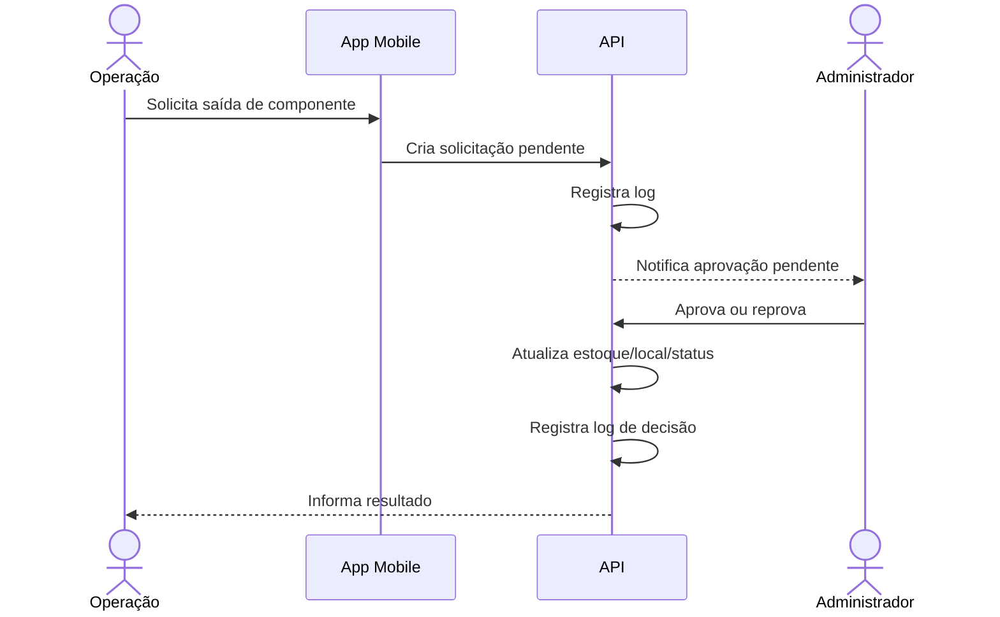

# Login, Permissões e Sessões — Plano de Implementação

## 1. Objetivo

Definir o modelo de autenticação, controle de acesso e sessão do sistema REMOBS.

O sistema deve garantir que:

- Apenas usuários autorizados acessem o sistema;
- Cada usuário visualize somente o que sua função permite;
- Operações críticas exijam permissão adequada;
- Login, logout, falhas e acessos negados sejam registrados;
- Usuários em campo possam continuar trabalhando com sessão válida em baixa conectividade.

---

## 2. Login

## 2.1 Campos da tela de login

- E-mail institucional ou usuário;
- Senha;
- Botão **Entrar**;
- Link **Esqueci minha senha**;
- Indicador de ambiente, quando não for produção;
- Mensagem de status da conexão;
- Opção de lembrar dispositivo, se aprovada pela política interna.

## 2.2 Regras

- A senha nunca deve ser armazenada em texto puro;
- A autenticação deve ocorrer no backend;
- O backend deve retornar um token de acesso curto e um token de renovação;
- Após várias tentativas inválidas, o usuário deve sofrer bloqueio temporário;
- Login bem-sucedido, login malsucedido e logout devem gerar log;
- O usuário bloqueado, inativo ou removido não pode acessar;
- O usuário deve aceitar termos internos, caso o projeto exija.

## 2.3 Recuperação de senha

Fluxo sugerido:

1. Usuário informa e-mail;
2. Sistema envia link temporário;
3. Usuário define nova senha;
4. Todas as sessões antigas podem ser revogadas;
5. Evento é registrado em log de auditoria.

## 2.4 Sessão em celular

Requisitos:

- Renovação automática da sessão enquanto o usuário estiver ativo;
- Logout manual visível no menu;
- Expiração por inatividade;
- Revalidação de permissões após troca de papel;
- Revogação remota de sessão pelo administrador;
- Armazenamento local mínimo e seguro.

## 2.5 Login offline

Regra recomendada:

- Não permitir primeiro login offline;
- Permitir uso offline somente para usuário que já fez login com sucesso no dispositivo;
- Não guardar senha localmente;
- Permitir apenas ações que possam ser sincronizadas depois;
- Bloquear ações sensíveis se a sessão estiver expirada e não houver conexão para renovar;
- Marcar claramente que o usuário está em **Modo offline**.

---

## 3. Modelo de permissões

Recomenda-se usar uma combinação de:

- **RBAC:** controle por papel;
- **ABAC simples:** regras adicionais por local, status, propriedade do item ou tipo de operação.

Exemplo:

- Um usuário de Operação pode solicitar saída, mas não aprovar a própria solicitação;
- Um Administrador pode aprovar saída, mas a aprovação deve ser logada;
- DGAes pode visualizar alertas e painéis, mas não alterar estoque;
- Desenvolvedor pode configurar campos e estruturas, mas alterações em produção devem ser auditadas.

---

## 4. Papéis sugeridos

## 4.1 Desenvolvedor

Responsável por configuração estrutural do sistema.

Permissões:

- Criar e editar cadastros-base;
- Criar campos e categorias;
- Configurar módulos;
- Gerenciar permissões técnicas;
- Acessar logs técnicos, quando autorizado;
- Ajustar regras de status e validações.

Restrições recomendadas:

- Alterações em produção devem exigir justificativa;
- Não deve aprovar movimentações operacionais em nome da operação, salvo política interna.

## 4.2 Administrador

Responsável pela administração operacional do inventário.

Permissões:

- Editar inventário;
- Corrigir inconsistências;
- Aprovar ou reprovar solicitações de saída;
- Autorizar atualização de estoque;
- Vincular componentes a plataformas;
- Alterar status operacional;
- Gerar relatórios;
- Consultar logs de auditoria.

## 4.3 Operação

Usuário de campo.

Permissões:

- Visualizar inventário liberado;
- Preencher checklists;
- Solicitar saída de material;
- Registrar fotos;
- Registrar observações;
- Solicitar correção de inventário;
- Visualizar status de plataformas e sensores.

Restrições:

- Não aprova saída;
- Não altera estoque diretamente sem fluxo de aprovação;
- Não cria campos estruturais do sistema.

## 4.4 DGAes

Usuário de acompanhamento, gestão e comunicação.

Permissões:

- Visualizar dashboards;
- Receber alertas;
- Enviar ou receber mensagens operacionais, se o módulo existir;
- Consultar status de plataformas;
- Consultar histórico e relatórios permitidos.

Restrições:

- Não movimenta estoque;
- Não altera cadastros estruturais.

## 4.5 Compras

Papel complementar recomendado.

Permissões:

- Visualizar itens abaixo do estoque mínimo;
- Receber alertas de reposição;
- Atualizar status de solicitação de compra;
- Anexar notas fiscais, quando autorizado.

## 4.6 Manutenção

Papel complementar recomendado.

Permissões:

- Visualizar itens em manutenção;
- Registrar diagnóstico;
- Atualizar status de manutenção;
- Anexar fotos, laudos e documentos;
- Informar retorno ao estoque.

---

## 5. Matriz de permissões inicial

| Ação / Módulo | Desenvolvedor | Admin | Operação | DGAes | Compras | Manutenção |
|---|---:|---:|---:|---:|---:|---:|
| Acessar sistema | Sim | Sim | Sim | Sim | Sim | Sim |
| Gerenciar usuários | Sim | Sim | Não | Não | Não | Não |
| Gerenciar papéis/permissões | Sim | Parcial | Não | Não | Não | Não |
| Criar campos/categorias | Sim | Parcial | Não | Não | Não | Não |
| Cadastrar consumível | Sim | Sim | Solicita | Não | Parcial | Não |
| Editar consumível | Sim | Sim | Solicita | Não | Parcial | Não |
| Movimentar estoque | Não recomendado | Sim | Solicita | Não | Não | Parcial |
| Aprovar saída | Não recomendado | Sim | Não | Não | Não | Não |
| Solicitar saída | Sim | Sim | Sim | Não | Não | Sim |
| Cadastrar componente permanente | Sim | Sim | Solicita | Não | Não | Parcial |
| Vincular componente a plataforma | Sim | Sim | Solicita | Consulta | Não | Parcial |
| Alterar status de plataforma | Sim | Sim | Solicita | Consulta | Não | Parcial |
| Preencher checklist | Não | Sim | Sim | Consulta | Não | Sim |
| Visualizar dashboard | Sim | Sim | Sim | Sim | Sim | Sim |
| Consultar logs de auditoria | Sim | Sim | Não | Parcial | Não | Parcial |
| Exportar relatórios | Sim | Sim | Parcial | Sim | Parcial | Parcial |

Observação: permissões “Parcial” devem ser detalhadas por ação, local e tipo de dado.

---

## 6. Estrutura técnica de permissões

## 6.1 Entidades

- `users`
- `roles`
- `permissions`
- `user_roles`
- `role_permissions`
- `sessions`
- `access_policies`

## 6.2 Formato de permissão

Formato sugerido:

```text
recurso:acao:escopo
```

Exemplos:

```text
inventory:item:create
inventory:item:update
inventory:item:read
inventory:movement:request
inventory:movement:approve
platform:status:update
sensor:status:update
checklist:submit
audit:log:read
admin:user:manage
```

## 6.3 Escopos

- Global;
- Por base/local;
- Por tipo de plataforma;
- Por módulo;
- Por status do item;
- Por responsável.

---

## 7. Fluxos críticos

## 7.1 Solicitação de saída



## 7.2 Alteração de status operacional

Regras:

- Operação pode sugerir alteração;
- Admin ou Manutenção pode confirmar;
- Alteração deve exigir motivo;
- Status anterior e novo status devem ser salvos;
- Se o novo status for crítico, gerar alerta.

## 7.3 Correção de estoque

Regras:

- Toda correção manual deve exigir justificativa;
- Correção deve gerar log com valor anterior e novo valor;
- Correções acima de limite definido devem exigir aprovação extra.

---

## 8. Política de sessão e segurança

## 8.1 Expiração

Sugestão:

- Token de acesso curto;
- Token de renovação com validade maior;
- Expiração por inatividade;
- Revogação ao trocar senha;
- Revogação manual pelo administrador.

## 8.2 Bloqueio

Bloquear temporariamente após tentativas inválidas consecutivas.

Eventos registrados:

- Login bem-sucedido;
- Login inválido;
- Usuário bloqueado;
- Usuário desbloqueado;
- Redefinição de senha;
- Revogação de sessão;
- Acesso negado por permissão.

## 8.3 Dispositivos

Registrar:

- Tipo do dispositivo;
- Navegador;
- IP;
- Data/hora;
- Último acesso;
- Sessão ativa;
- Modo offline usado ou não.

---

## 9. Critérios de aceite

- Um usuário inativo não consegue entrar;
- Um usuário de Operação não consegue aprovar saída;
- Um Administrador consegue aprovar saída;
- Uma tentativa de acesso não autorizado retorna erro e gera log;
- A troca de papel do usuário tem efeito após novo carregamento de permissões;
- O app mostra aviso claro quando estiver offline;
- O usuário não consegue realizar ação sensível offline sem sessão válida;
- Todos os eventos de login e permissões aparecem no log.
