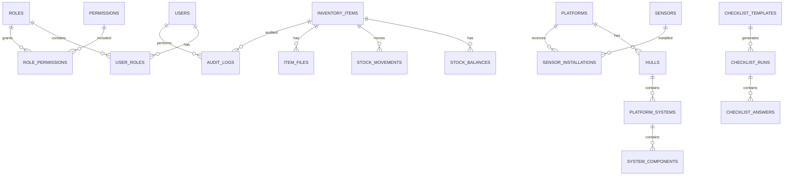

# Modelagem de Dados e API — Plano Inicial

## 1. Objetivo

Definir uma modelagem inicial para o sistema REMOBS, contemplando inventário, plataformas, sensores, usuários, permissões, logs e operação em campo.

A modelagem deve permitir evolução incremental, sem travar futuras integrações com sistemas patrimoniais, compras, manutenção ou acompanhamento operacional.

---

## 2. Entidades principais



---

## 3. Usuários e permissões

## 3.1 `users`

| Campo | Descrição |
|---|---|
| id | UUID |
| name | Nome |
| email | E-mail/login |
| password_hash | Hash da senha |
| status | active, inactive, blocked |
| last_login_at | Último login |
| created_at | Data de criação |
| updated_at | Última atualização |

## 3.2 `roles`

Papéis iniciais:

- developer;
- admin;
- operation;
- dgaes;
- purchases;
- maintenance.

## 3.3 `permissions`

Permissões em formato `recurso:acao`.

Exemplos:

- `inventory:read`
- `inventory:create`
- `inventory:update`
- `inventory:delete`
- `movement:request`
- `movement:approve`
- `platform:read`
- `platform:update_status`
- `sensor:update_status`
- `checklist:submit`
- `audit:read`
- `user:manage`

---

## 4. Inventário

## 4.1 `inventory_items`

Representa consumíveis e componentes permanentes.

| Campo | Descrição |
|---|---|
| id | UUID |
| item_type | consumable ou permanent_component |
| category_id | Categoria |
| name | Nome do item |
| brand | Marca |
| model | Modelo |
| serial_number | Número de série, se aplicável |
| patrimony_number | Número CADEM/TERP ou equivalente |
| invoice_number | Nota fiscal |
| description | Descrição |
| condition_status | operacional, inoperante, manutenção, avariado |
| current_location_id | Local atual |
| minimum_stock_national | Estoque mínimo nacional |
| minimum_stock_import | Estoque mínimo para importação |
| minimum_stock_maintenance | Estoque mínimo para manutenção |
| ideal_stock | Estoque ideal |
| is_active | Ativo/inativo |
| created_at | Data de criação |
| updated_at | Última atualização |

Observação:

- Para consumíveis, `serial_number` pode ser nulo;
- Para componentes permanentes, número de série ou patrimônio deve ser fortemente recomendado;
- A separação entre consumível e permanente também pode ser feita por tabelas especializadas se o projeto exigir.

## 4.2 `item_categories`

Categorias sugeridas:

- Sensor;
- Eletrônico;
- Ferramenta;
- Mecânico;
- Cabo;
- Estrutura;
- Consumível;
- Energia;
- Documentação.

## 4.3 `locations`

Locais sugeridos:

- Estoque;
- Laboratório;
- Manutenção;
- Pátio;
- Boia;
- Plataforma móvel;
- Campo;
- Em trânsito;
- Descartado.

## 4.4 `stock_balances`

| Campo | Descrição |
|---|---|
| id | UUID |
| item_id | Item |
| location_id | Local |
| quantity | Quantidade atual |
| reserved_quantity | Quantidade reservada |
| updated_at | Última atualização |

## 4.5 `stock_movements`

| Campo | Descrição |
|---|---|
| id | UUID |
| item_id | Item |
| movement_type | entrada, saída, transferência, ajuste, reserva, devolução |
| from_location_id | Origem |
| to_location_id | Destino |
| quantity | Quantidade |
| requested_by | Solicitante |
| approved_by | Aprovador |
| status | pending, approved, rejected, cancelled, completed |
| reason | Justificativa |
| created_at | Criação |
| approved_at | Aprovação |
| completed_at | Conclusão |

---

## 5. Plataformas, cascos e sistemas

## 5.1 `platforms`

| Campo | Descrição |
|---|---|
| id | UUID |
| name | Nome/código da plataforma |
| platform_type | fixed_buoy, auv, glider, sailbuoy, argo_float |
| manufacturer | Fabricante, se aplicável |
| model | Modelo |
| operational_status | em_operacao, em_montagem, disponivel, manutencao, offline |
| current_location_id | Local atual |
| description | Descrição |
| created_at | Criação |
| updated_at | Atualização |

## 5.2 `hulls`

Representa cascos de boias.

| Campo | Descrição |
|---|---|
| id | UUID |
| platform_id | Plataforma associada, se houver |
| code | Código do casco |
| model | Modelo |
| status | disponível, em_montagem, em_operacao, manutenção |
| notes | Observações |

## 5.3 `platform_systems`

Sistemas previstos:

- Energia;
- Processamento;
- Aquisição;
- Transmissão;
- Sinalização;
- Fundeio;
- Estruturas e suportes.

## 5.4 `system_components`

Vincula componentes permanentes ou itens a sistemas.

| Campo | Descrição |
|---|---|
| id | UUID |
| platform_system_id | Sistema |
| inventory_item_id | Componente |
| installed_at | Data de instalação |
| removed_at | Data de remoção |
| status | instalado, removido, avariado, manutenção |
| notes | Observações |

---

## 6. Sensores

## 6.1 `sensors`

| Campo | Descrição |
|---|---|
| id | UUID |
| sensor_type | oceanografico ou meteorologico |
| family | ADCP, ondógrafo, anemômetro, barômetro, termo-higrômetro, radiômetro |
| brand | Marca |
| model | Modelo |
| serial_number | Número de série |
| patrimony_number | Patrimônio |
| operational_status | em_operacao, inconsistencia, nao_instalado, avariado |
| calibration_due_at | Próxima calibração |
| notes | Observações |

## 6.2 Modelos mencionados no levantamento

### Oceanográficos

- ADCP Aquadopp 400;
- ADCP Signature 500;
- Ondógrafo G3;
- Ondógrafo SBG.

### Meteorológicos

- Anemômetro Young 5106;
- Anemômetro Young 5103;
- Anemômetro Gill;
- Barômetro PTB110;
- Termo-higrômetro HMP45A;
- Radiômetro LI-COR.

## 6.3 `sensor_installations`

| Campo | Descrição |
|---|---|
| id | UUID |
| sensor_id | Sensor |
| platform_id | Plataforma |
| installed_at | Instalação |
| removed_at | Remoção |
| installed_by | Usuário |
| removed_by | Usuário |
| status | ativo, removido, avariado, inconsistente |
| notes | Observações |

---

## 7. Documentos e fotos

## 7.1 `files`

| Campo | Descrição |
|---|---|
| id | UUID |
| original_name | Nome original |
| storage_key | Caminho no storage |
| mime_type | Tipo do arquivo |
| size_bytes | Tamanho |
| uploaded_by | Usuário |
| created_at | Upload |

## 7.2 `entity_files`

Vínculo genérico entre arquivo e entidade.

| Campo | Descrição |
|---|---|
| id | UUID |
| file_id | Arquivo |
| entity_type | item, platform, sensor, movement, checklist |
| entity_id | ID da entidade |
| file_role | foto, nota_fiscal, manual, calibração, relatório, configuração, log |
| notes | Observações |

---

## 8. Checklists

## 8.1 `checklist_templates`

- Nome;
- Tipo de plataforma;
- Versão;
- Ativo/inativo;
- Itens obrigatórios.

## 8.2 `checklist_runs`

- Template;
- Plataforma;
- Usuário;
- Status: rascunho, enviado, aprovado, reprovado;
- Data/hora;
- Localização opcional;
- Origem: online ou offline.

## 8.3 `checklist_answers`

- Pergunta;
- Resposta;
- Foto obrigatória, quando aplicável;
- Observação;
- Validação.

---

## 9. Alertas

## 9.1 `alerts`

| Campo | Descrição |
|---|---|
| id | UUID |
| alert_type | estoque_minimo, calibração, manutenção, sensor_avariado, inconsistência |
| severity | info, warning, critical |
| entity_type | Entidade relacionada |
| entity_id | ID da entidade |
| title | Título |
| message | Mensagem |
| status | open, acknowledged, resolved |
| assigned_to | Responsável opcional |
| created_at | Criação |
| resolved_at | Resolução |

---

## 10. API inicial sugerida

## 10.1 Autenticação

```text
POST   /auth/login
POST   /auth/logout
POST   /auth/refresh
POST   /auth/forgot-password
POST   /auth/reset-password
GET    /auth/me
```

## 10.2 Usuários e permissões

```text
GET    /users
POST   /users
GET    /users/:id
PATCH  /users/:id
POST   /users/:id/roles
DELETE /users/:id/roles/:roleId
GET    /roles
GET    /permissions
```

## 10.3 Inventário

```text
GET    /inventory/items
POST   /inventory/items
GET    /inventory/items/:id
PATCH  /inventory/items/:id
DELETE /inventory/items/:id
GET    /inventory/items/:id/history
GET    /inventory/items/:id/files
POST   /inventory/items/:id/files
```

## 10.4 Movimentações

```text
GET    /inventory/movements
POST   /inventory/movements/request
POST   /inventory/movements/:id/approve
POST   /inventory/movements/:id/reject
POST   /inventory/movements/:id/complete
POST   /inventory/movements/:id/cancel
```

## 10.5 Plataformas e sensores

```text
GET    /platforms
POST   /platforms
GET    /platforms/:id
PATCH  /platforms/:id
GET    /platforms/:id/systems
POST   /platforms/:id/sensors
DELETE /platforms/:id/sensors/:sensorId
GET    /sensors
POST   /sensors
GET    /sensors/:id
PATCH  /sensors/:id
```

## 10.6 Checklists

```text
GET    /checklist/templates
POST   /checklist/templates
GET    /checklist/runs
POST   /checklist/runs
GET    /checklist/runs/:id
PATCH  /checklist/runs/:id
POST   /checklist/runs/:id/submit
```

## 10.7 Offline sync

```text
POST   /sync/push
GET    /sync/pull?since=timestamp
GET    /sync/status
POST   /sync/resolve-conflict
```

## 10.8 Logs

```text
GET    /audit-logs
GET    /audit-logs/:id
GET    /audit-logs/export
```

---

## 11. Sincronização offline

## 11.1 Conceito

A aplicação mobile/PWA deve salvar ações localmente quando não houver conexão.

Cada ação offline deve conter:

- ID local;
- Tipo de ação;
- Entidade;
- Payload;
- Usuário;
- Data/hora local;
- Estado da sincronização;
- Tentativas;
- Erro, se houver.

## 11.2 Conflitos

Um conflito ocorre quando:

- O item foi alterado no servidor após o usuário carregar os dados;
- O estoque disponível mudou;
- A permissão do usuário mudou;
- O item foi inativado;
- A plataforma mudou de status.

## 11.3 Estratégia de resolução

- Não sobrescrever silenciosamente;
- Mostrar conflito ao usuário autorizado;
- Manter payload original;
- Registrar decisão em log;
- Permitir descartar, reaplicar ou mesclar quando fizer sentido.

---

## 12. Critérios de aceite

- Entidades principais permitem cadastro e consulta;
- APIs validam permissões no backend;
- Toda alteração crítica gera log;
- Arquivos ficam vinculados à entidade correta;
- Histórico de item e sensor pode ser consultado;
- Ação offline sincronizada aparece no histórico;
- Conflitos não geram perda silenciosa de dados.
