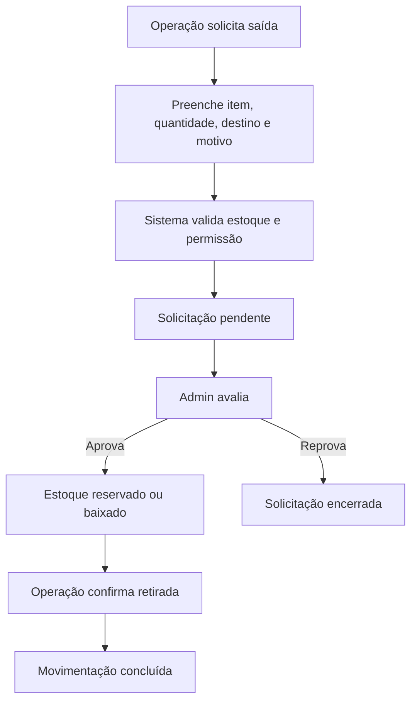

# Módulos de Inventário e Operação — Detalhamento Funcional

## 1. Visão geral

Este documento detalha os módulos funcionais do sistema REMOBS, conforme os ambientes levantados:

1. Controle de Material;
2. Gerenciamento e Acompanhamento;
3. Operação em campo;
4. Alertas e documentação.

---

# 2. Controle de Material

## 2.1 Consumíveis

Módulo para materiais que são consumidos, repostos ou comprados periodicamente.

### Campos obrigatórios

- Item;
- Marca;
- Modelo ou especificação;
- Quantidade;
- Unidade de medida;
- Local;
- Estoque ideal;
- Estoque mínimo nacional;
- Estoque mínimo para importação;
- Responsável pelo cadastro.

### Campos opcionais

- Nota fiscal;
- Fornecedor;
- Código interno;
- Foto;
- Observações;
- Categoria;
- Data de validade, quando aplicável;
- Lote, quando aplicável.

### Exemplos

- Silicone bisnaga 200 ml;
- Silicone bisnaga 400 ml;
- Cabos;
- Materiais de manutenção;
- Itens de reposição.

### Regras

- O mesmo item pode ter marca/modelo diferentes;
- O sistema deve impedir confusão entre itens similares;
- Campos de diferenciação devem aparecer claramente;
- Estoque abaixo do mínimo deve gerar alerta;
- Alteração manual de quantidade deve exigir justificativa.

---

## 2.2 Componentes permanentes

Módulo para equipamentos reutilizáveis, rastreáveis e possivelmente patrimoniados.

### Categorias iniciais

- Sensores;
- Eletrônicos;
- Ferramentas;
- Equipamentos mecânicos;
- Cabos;
- Estruturas;
- Energia;
- Fundeio;
- Outros.

### Campos obrigatórios

- Tipo;
- Item;
- Marca;
- Modelo;
- Número de série, quando existir;
- Condição;
- Local;
- Status;
- Responsável pelo cadastro.

### Campos recomendados

- Número TERP ou CADEM;
- Nota fiscal;
- Foto;
- Manual;
- Certificado de calibração;
- Histórico de manutenção;
- Data de aquisição;
- Vida útil estimada;
- Observações.

### Condição/status do componente

- Operacional;
- Inoperante;
- Em manutenção;
- Avariado;
- Descartado;
- Reservado;
- Instalado.

### Regras

- Componente permanente deve ter histórico de localização;
- Se estiver instalado em plataforma, o local deve refletir isso;
- Se for enviado para manutenção, deve abrir registro de manutenção;
- Se for avariado, deve gerar alerta;
- Movimentações críticas exigem aprovação.

---

## 2.3 Controle de local

Locais iniciais:

- Estoque;
- Laboratório;
- Pátio;
- Manutenção;
- Boia;
- Plataforma móvel;
- Campo;
- Em trânsito.

### Regras

- Local deve ser obrigatório;
- Alteração de local gera movimentação;
- Local “Boia” deve exigir vínculo com plataforma;
- Local “Manutenção” deve exigir motivo ou ordem de manutenção;
- Local “Em trânsito” deve ter origem, destino e responsável.

---

## 2.4 Controle de saída

Fluxo sugerido:

### Campos da solicitação

- Item;
- Quantidade;
- Local de origem;
- Local de destino;
- Plataforma associada, se houver;
- Motivo;
- Data necessária;
- Foto opcional;
- Solicitante;
- Aprovador.

### Regras

- Operação solicita;
- Admin aprova;
- O próprio solicitante não deve aprovar, salvo exceção formal;
- Sistema deve bloquear saída acima do estoque disponível;
- Saída de componente permanente deve exigir identificação individual;
- Toda decisão gera log.

---

## 2.5 Inventário físico periódico

Funcionalidade para conferência de estoque.

### Periodicidade sugerida

- A cada 6 meses;
- Ou por local/categoria conforme necessidade.

### Fluxo

1. Admin cria campanha de conferência;
2. Operação ou responsável confere itens;
3. Divergências são marcadas;
4. Admin aprova ajustes;
5. Ajustes geram logs e relatório final.

---

# 3. Gerenciamento e Acompanhamento

## 3.1 Plataformas fixas

Tipos e exemplos:

- Boias AXYS 3M;
- Boias AXYS 2.3;
- Boias AXYS 2.4;
- Boias AXYS 2.5;
- TriAxys;
- Spotter.

### Campos

- Nome/código;
- Tipo;
- Modelo;
- Status operacional;
- Local atual;
- Data de implantação;
- Última transmissão;
- Casco associado;
- Sensores associados;
- Documentação.

## 3.2 Plataformas móveis

Tipos e exemplos:

- Glider;
- SailBuoy;
- Argo Float.

### Campos

- Nome/código;
- Tipo;
- Modelo;
- Status operacional;
- Missão atual;
- Última comunicação;
- Sensores associados;
- Documentação.

---

## 3.3 Status operacional das plataformas/cascos

| Status | Cor | Significado |
|---|---|---|
| Em operação | Verde | Plataforma instalada, transmitindo ou operacionalmente ativa |
| Em montagem | Amarelo | Plataforma em preparação/montagem |
| Disponível para montagem | Cinza | Casco disponível no pátio ou estoque |
| Em manutenção/offline | Vermelho | Plataforma indisponível, com falha ou manutenção crítica |

### Regras

- Alteração para vermelho deve exigir justificativa;
- Alteração para verde deve validar checklist mínimo;
- Última transmissão deve ser visível quando existir integração;
- Histórico de status deve ser consultável.

---

## 3.4 Cascos e sistemas

Cada casco/plataforma pode conter sistemas:

- Energia;
- Processamento;
- Aquisição;
- Transmissão;
- Sinalização;
- Fundeio;
- Estruturas e suportes.

### Energia

Componentes possíveis:

- Baterias;
- Painéis solares;
- Controlador de carga;
- Cabos.

### Eletrônica

Componentes possíveis:

- Eletrônica AXYS;
- Eletrônica Messen UCMO;
- Módulos de aquisição;
- Módulos de comunicação.

---

# 4. Sensores

## 4.1 Sensores oceanográficos

Categorias e exemplos:

- ADCP Aquadopp 400;
- ADCP Signature 500;
- Ondógrafo G3;
- Ondógrafo SBG.

### Documentação relacionada

- Configuração;
- Logs;
- Certificado de calibração;
- Número de série;
- Manual;
- Histórico de instalação.

## 4.2 Sensores meteorológicos

Categorias e exemplos:

- Anemômetro Young 5106;
- Anemômetro Young 5103;
- Anemômetro Gill;
- Barômetro PTB110;
- Termo-higrômetro HMP45A;
- Radiômetro LI-COR.

## 4.3 Status operacional dos sensores

| Status | Cor | Significado |
|---|---|---|
| Em operação | Verde | Sensor instalado e operando regularmente |
| Inconsistência | Amarelo | Medições inconsistentes ou documentação faltando |
| Não instalado | Cinza | Sensor ausente ou disponível sem instalação |
| Avariado | Vermelho | Sensor com defeito ou sem envio de dados |

### Regras

- Inconsistência deve permitir comentário e evidência;
- Avariado deve gerar alerta;
- Sensor em operação deve estar vinculado a plataforma;
- Calibração vencida deve gerar alerta;
- Troca de sensor deve gerar histórico.

---

# 5. Documentação

## 5.1 Tipos de documento

- Manual;
- Nota fiscal;
- Certificado de calibração;
- Configuração;
- Log;
- Relatório;
- Foto;
- Laudo de manutenção;
- Termo de saída;
- Comprovante de recebimento.

## 5.2 Regras

- Documento deve ter tipo;
- Documento deve estar vinculado a uma entidade;
- Upload deve registrar usuário e data;
- Remoção deve ser lógica e auditada;
- Documento crítico deve ter controle de permissão.

---

# 6. Alertas

## 6.1 Estoque

Gatilhos:

- Abaixo do estoque mínimo nacional;
- Abaixo do estoque mínimo para importação;
- Abaixo do estoque mínimo para manutenção;
- Item zerado;
- Item reservado e não retirado.

## 6.2 Calibração

Gatilhos:

- Calibração vencida;
- Calibração vencendo em X dias;
- Certificado ausente;
- Sensor em operação sem documentação.

## 6.3 Manutenção

Gatilhos:

- Item em manutenção há mais de X dias;
- Plataforma offline;
- Sensor avariado;
- Inconsistência aberta sem tratativa.

---

# 7. Relatórios

Relatórios iniciais:

- Estoque crítico;
- Movimentações por período;
- Componentes por local;
- Componentes instalados por plataforma;
- Sensores avariados;
- Calibrações vencidas;
- Plataformas por status;
- Logs de auditoria;
- Solicitações pendentes.

---

# 8. Critérios de aceite

- Consumível pode ser cadastrado com estoque mínimo;
- Componente permanente pode ser cadastrado com número de série;
- Item pode ter foto e documento;
- Operação consegue solicitar saída pelo celular;
- Admin consegue aprovar saída;
- Sensor pode ser vinculado a plataforma;
- Status de sensor e plataforma são exibidos por cor;
- Alerta é gerado para estoque crítico;
- Histórico completo é consultável.
